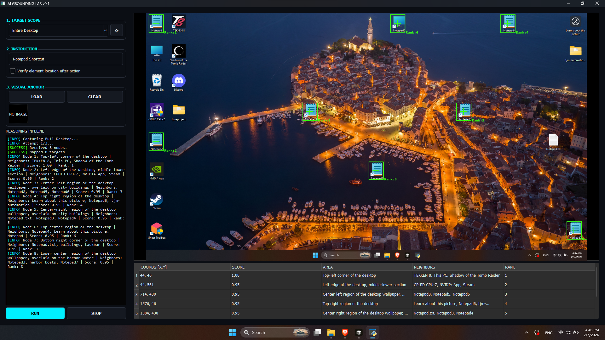
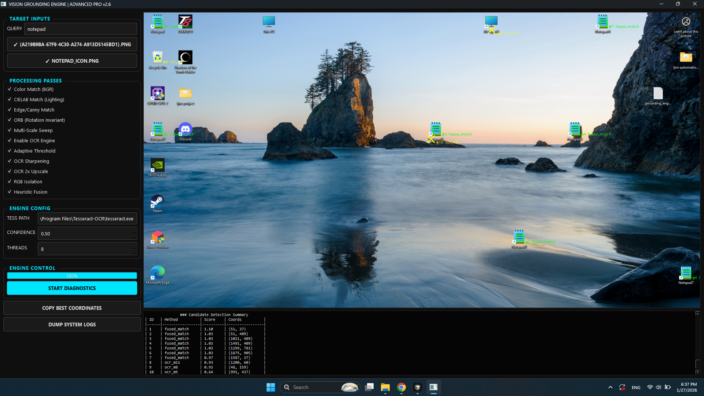

# AI-Powered Vision Grounding & Notepad Automation

This repository features a cutting-edge **AI LLM Reasoning Engine** designed for semantic, context-aware interaction. While an OpenCV-based module is included for benchmarking, the **LLM-based architecture is the primary solution** for production.

The LLM engine resolves the fundamental flaws of traditional computer vision, specifically the inaccurate scoring logic and the inability of template matching to handle non-default icon sizes.

---

## 🚀 Primary Execution (AI Agent)

This project uses `uv` for lightning-fast dependency management. The LLM commands provide the most stable, production-ready experience.

| Command | Action |
| :--- | :--- |
| **`uv sync`** | Install all dependencies and synchronize the virtual environment. |
| **`uv run start-llm`** | **Launch the primary AI Reasoning GUI.** |
| **`uv run notepad-llm`** | **Execute the automated Notepad task via LLM reasoning.** |
| `uv run start-opencv` | *Optional:* Open legacy OpenCV diagnostic lab. |
| `uv run notepad-opencv` | *Optional:* Run legacy OpenCV automation (Prone to failure). |

---

## 📂 Repository Structure (`src/`)

The architecture prioritizes high-level AI reasoning, using shared services only for basic OS-level tasks.

* **`llm_solution/`**: **The Core Engine.** Contains the vision-language model logic and the stable agent interface.
* **`screenshot_service.py`**: A shared utility for window management and workspace recovery.
* **`opencv_solution/`**: *Legacy/Optional.* Contains heuristic-based attempts (OCR, templates) that serve as a baseline for the LLM's superior performance.

---

## 🤖 The Primary Solution: LLM Reasoning Engine

The LLM engine is the "brain" of this project. It is the **recommended standard** because it overcomes the mathematical and visual limitations of the legacy engine.

### 1. Agent Control Center (`gui.py`)

* **Semantic Intelligence**: Correctly distinguishes between "Notepad" and "Notepad++." Traditional OCR (Tesseract) often returns false positives when similar strings are present.
* **Resolution Agnostic**: Unlike template matching, the LLM handles non-default desktop icon sizes and DPI scaling without needing constant parameter adjustment.

### 2. Intelligent Notepad Automation (`notepad_automation.py`)

* **AI-Located Entry**: Uses the Grounding Engine to find the "Notepad Shortcut" dynamically, ensuring the script works regardless of where the icon is placed on the desktop.
* **Workspace Recovery**: Automatically captures the state of visible windows before execution and restores them afterward, providing a seamless "non-destructive" automation experience.
* **Data-to-Disk Pipeline**: Fetches real-time data from external APIs and uses "bomb-proof" keyboard automation to handle save dialogs and file overwrites across various OS versions.

---

## 🔬 Legacy Supplement: OpenCV Grounding (Optional)

The `DesktopGroundingEngine` (OpenCV) is provided strictly for **diagnostic comparison**. It utilizes a heuristic fusion approach (CIELAB, ORB, Tesseract) that is fundamentally limited:

> [!WARNING]  
> **Technical Failures**:
>
> * **Inaccurate Scoring**: The internal ranking system is not reliable; it often fails to accurately prioritize the true target over noise.
> * **Scaling Brittleness**: Template matching (BGR/Edge) is tied to fixed pixel dimensions. It **fails consistently** when using non-default desktop icon sizes.
> * **OCR False Positives**: Tesseract frequently misidentifies similar text elements, leading to incorrect clicks on related but wrong applications (e.g., Notepad++).

---

## ⚖️ Why LLM is the Standard Path

| Feature | **AI-Based Grounding (Primary)** | OpenCV Grounding (Unstable) |
| :--- | :--- | :--- |
| **Scaling** | **Adaptive**; ignores icon size changes. | **Brittle**; fails on non-default sizes. |
| **Scoring** | **Contextual**; logical target selection. | **Heuristic**; inaccurate ranking logic. |
| **Stability** | **High**; stable across OS versions. | **Low**; sensitive to DPI and UI shifts. |
| **Accuracy** | Distinguishes "Notepad" from "Notepad++". | Prone to Tesseract false positives. |

---

## 🛠 Prerequisites

1. **Python 3.14** and **UV** package manager.
2. **Environment Variables**: A `.env` file with your AI API keys is **required** to power the Reasoning Engine.
3. **Tesseract (Optional)**: Only required if you intend to benchmark the legacy OpenCV tools.
