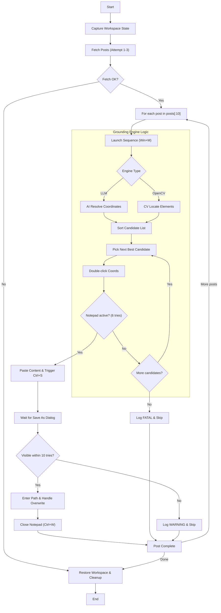

# Vision‑Based Desktop Automation — Notepad Workflow

> Technical overview of a Notepad automation project demonstrating both AI and CV grounding, screenshot management, task orchestration, and robustness measures.

---

## Quick Facts

* **Target OS / resolution:** Windows 10/11 — 1920×1080
* **Python version:** 3.14 (extensive use of type hints)
* **Dependency management / runner:** `uv`
* **Environment variables required:**

  * `GEMINI_API_KEY` — API key for AI vision model
  * `API_URL` — source of posts to write (e.g., JSONPlaceholder)
* **Optional:** Tesseract OCR (`TESS_PATH`) for OpenCV grounding

---

## Execution Commands

```bash
# Sync environment
uv sync

# LLM solution
uv run start-llm
uv run notepad-llm

# OpenCV solution (optional)
uv run start-opencv
uv run notepad-opencv
```

---

## Libraries Used

| Library                 | Purpose                                     |
| ----------------------- | ------------------------------------------- |
| `pyautogui`             | Screenshot and input automation             |
| `pygetwindow`           | Enumerate/manage OS windows                 |
| `pyperclip`             | Clipboard interaction for paste reliability |
| `requests`              | Fetch posts data                            |
| `python-dotenv`         | Load `.env` variables                       |
| `Pillow`                | Image manipulation (ScreenshotService)      |
| `google.genai`          | Vision + language model API (LLM grounding) |
| `opencv-python`         | Template matching and image processing      |
| `numpy`                 | Array math and geometry utilities           |
| `pytesseract`           | OCR engine for textual passes               |
| `typing`, `dataclasses` | Code structure and type safety              |

---

## High‑Level Architecture

1. **ScreenshotService**

   * Handles workspace state (minimize/restore) and desktop/app captures.

2. **Grounding Engines**

   * **LLM Grounding** — AI reasoning to locate UI elements with semantics.
   * **OpenCV Grounding** — traditional template + OCR detection with fusion logic.

3. **Notepad Automation**

   * Drives launching Notepad, typing text, saving files, and cleanup.

---

## Notepad Automation Workflow (Step‑by‑Step)

### 1. Setup

1. Place a Notepad shortcut on the desktop.
2. Add required environment variables in a `.env` file.
3. (Optional) Install Tesseract OCR and set its path.

---

### 2. Workspace Snapshot

* The automation captures the current visible windows for restoration after execution.

---

### 3. For Each of the First 10 Posts

#### A — Prepare Desktop State

* Minimize all windows (`Win + M`).
* Click at corner (1, 1) to clear hover states.
* For OpenCV, save screenshot (`grounding_temp.png`) used by the engine.

#### B — Grounding & Launch Sequence

* **Candidate Extraction:** Both engines return a prioritized list of coordinates sorted by confidence score.
* **Launch Retry Loop:**
  * Iterates through candidates (starting with the highest score).
  * Performs a double-click and waits **3 seconds** (6 attempts) per candidate.
  * If the Notepad window does not appear, the system automatically attempts the **next best candidate**.
* **Verification:** If the entire list is exhausted without a successful launch, the post is logged as a `FATAL` failure and skipped.

#### C — Type Content

1. `Ctrl + N` to ensure a fresh document.
2. Construct content:

   ```text
   Title: {title}
   {body}
   ```

3. Paste via `pyperclip + Ctrl + V` to bypass pyautogui typing speed and character encoding issues.

#### D — Save File

1. `Ctrl + S` triggers Save As.
2. Wait for dialog to be visible.
3. Focus filename (`Alt + N`), paste path (`Desktop/tjm-project/post_{id}.txt`).
4. Confirm overwrite if prompt appears.
5. Close editor (`Ctrl + W` + fallback window close).

#### E — Cleanup & Next Post

* Small delay, then proceed.
* After loop, perform cleanup and restore windows.

---

## Error Handling & Robustness

* **API Resilience:** Implemented manual retries with **exponential backoff** (1s, 2s, 4s) for data fetching to handle transient network instability.
* **Multi-Candidate Recovery:** Grounding engines iterate through secondary matches if the primary candidate fails to launch the target application (e.g., due to a false positive or occlusion).
* **Verification Loops:** Nested wait-logic for window activation (6 tries per candidate) and file dialogs (10 tries) to synchronize with OS-level latency.
* **Workspace Integrity:** Guaranteed restoration of original window states and cleanup of temporary artifacts using `finally` blocks and `Path.unlink(missing_ok=True)`.
* **Visibility Edge Cases:** Factored in partial occlusion, DPI scaling, and busy backgrounds via coordinate normalization and multi-pass CV.
* **Overwrite Handling:** Automated detection and confirmation of "Save As" overwrite prompts.
* **Diagnostic Logging:** Engines support callback logging; OpenCV provides real-time performance metrics per detection pass.

---

## Screenshots & GUIs

### LLM Grounding GUI

Example of detected LLM coords:


### OpenCV Grounding GUI

Example of detected OpenCV coords:


### How the GUIs Were Created

Although I do not personally write PyQt code, I **designed the workflow, logic, and instructions** for the diagnostic GUIs, and **debugged and verified their behavior**. An AI implemented the PyQt applications according to these specifications. The GUIs were used **only to visualize detected desktop elements and generate example outputs** for demonstration purposes in this project; they are not part of the production automation.

---

## Workflow Diagram



---

## Scaling to Arbitrary Tasks

While this implementation focuses on Notepad, the architecture is designed for horizontal scaling across any desktop application:

1. **Configuration-Driven:** By swapping the `TEXT_QUERY` and `ICON_PATH` variables, the same pipeline can target any application (e.g., "Excel", "Slack", "VS Code").
2. **Resolution Independence:** The `ScreenshotService` and grounding engines utilize coordinate normalization ($Pixel_{coords} = Normalized_{coords} \times Resolution_{max}$). This allows the logic to work across different monitor setups (1080p, 1440p, 4K) without code changes.
3. **Generic Engine Interface:** The `automation_loop` accepts any `launch_func`. This allows for the addition of new grounding technologies (e.g., specialized YOLO models) without refactoring the core business logic.
4. **Semantic Flexibility:** The LLM engine can be tuned via system prompts to find icons based on visual descriptions rather than exact text matches, handling custom icon packs or localized OS languages.

---

## Architectural Decisions & Discussion

### Icon Detection & Alternatives

* **Hybrid Grounding:** Used **LLM Grounding** for high-level semantic reasoning and **OpenCV** for fast, pixel-level heuristic matching.
* **Why this?** Since the task requires grounding, I chose this hybrid approach to handle both "fuzzy" matches (where the LLM excels) and "exact" matches (where OpenCV is faster and cheaper).

### Performance & Optimization

* **Multithreaded OpenCV:** To minimize latency, the OpenCV engine executes detection passes in parallel using **Python threads** (`num_cores: 8`). This allows the script to check for different scales and colors simultaneously.

### Robustness & Scaling

* **Alpha Masking:** The OpenCV engine utilizes **PNG masking** with transparent backgrounds. This ensures the engine focuses only on the Notepad icon's shape and ignores the desktop background or "busy" wallpaper behind it.

* **Coordinate Normalization:** The system converts LLM-predicted coordinates (range 0.0–1.0) into actual screen pixels based on the active resolution ($Pixel = Normalized \times MaxResolution$). This ensures the script is **Resolution Independent** and works on 1080p, 1440p, or 4K monitors.

* **Multi-Scale Matching:** The engine automatically scales the template icon to multiple sizes before matching, making it robust against different Windows "Icon View" settings (Small/Medium/Large).

### Future Extensions

* **Local Inference:** With more time, I would research and integrate local open-vocabulary models like **Grounding DINO** or real-time detectors like **YOLO**. This would move the AI processing from a cloud API to the local machine, drastically reducing costs and improving privacy.

---

## Debug Tips

* Test icon at multiple screen resolutions.
* Use debug callbacks to log candidate coordinates.
* **Visual debugging with GUIs:**  
  * **OpenCV GUI:** Inspect detection passes, confidence scores, threads, Tesseract path, and icon size limits.  
  * **LLM GUI:** Optionally verify AI-predicted coordinates before automation.  
* Adjust template/OCR thresholds if detection fails.
