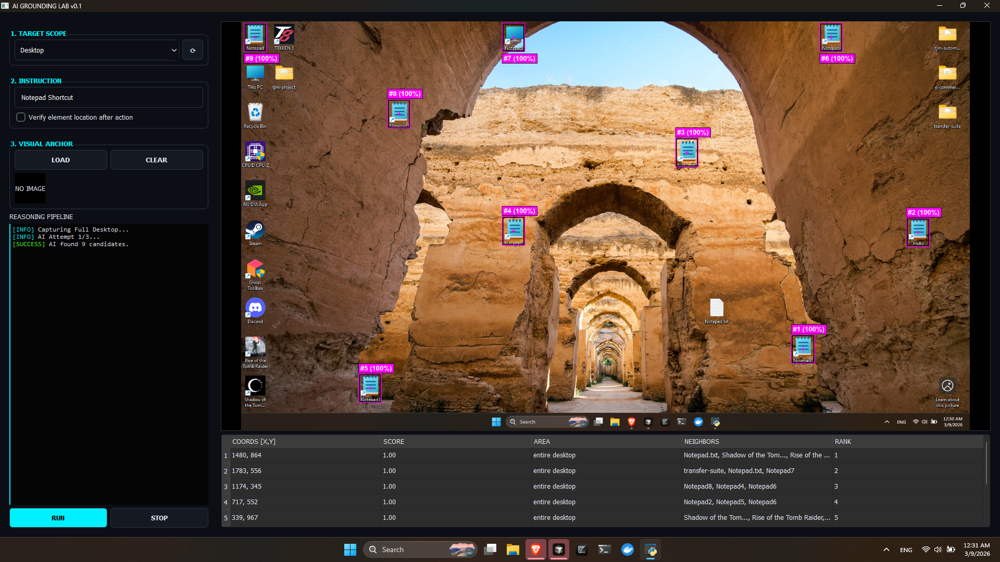

# Vision‑Based Desktop Automation — Notepad Workflow

> Technical overview of a Notepad automation project demonstrating both AI and CV grounding, screenshot management, task orchestration, and robustness measures.

---

## Getting Started

### 1. Environment Setup

* **Desktop Shortcut:** Place a shortcut to **Notepad** on your primary desktop.
* **Tesseract OCR:** Install [Tesseract](https://github.com/UB-Mannheim/tesseract/wiki) and note the installation path.
* **Environment Variables:** Create a `.env` file in the root directory (use `example.env` as a template):

  ```bash
  GEMINI_API_KEY=your_google_api_key_here
  API_URL=[https://jsonplaceholder.typicode.com/posts](https://jsonplaceholder.typicode.com/posts)
  ```

---

## Execution Commands

| Command                    | Action                                                   |
|----------------------------|----------------------------------------------------------|
| `uv sync`                  | Sync project dependencies and environment                |
| `uv run start-llm`         | Launch the AI Vision Diagnostic Lab                      |
| `uv run start-cv`          | Launch the OpenCV/OCR Diagnostic Lab                     |
| `uv run notepad-cv`        | Run the standard Notepad automation using the CV engine  |
| `uv run notepad-llm`       | Run the standard Notepad automation using the LLM engine |
| `uv run notepad-cv-first`  | Attempt CV detection first, fall back to LLM if it fails |
| `uv run notepad-llm-first` | Attempt LLM detection first, fall back to CV if it fails |

---

## Architecture & Repository Structure

The project is organized into two primary grounding engines (LLM and OpenCV) and a shared core for automation, screenshot management, and state orchestration.

1. **ScreenshotService** [(`src/screenshot_service.py`)](src/screenshot_service.py) — Manage workspace state (minimize/restore) and capture high-DPI desktop/app states.
2. **Grounding Engines** ([`src/llm_solution/engine.py`](src/llm_solution/engine.py), [`src/cv_solution/engine.py`](src/cv_solution/engine.py)) — Translate high-level intent into screen coordinates using either AI reasoning or traditional CV+OCR fusion.
3. **Automation Orchestration** ([`src/notepad_task.py`](src/notepad_task.py), [`src/strategies.py`](src/strategies.py)) — Drive the finite state machine for launching, typing, saving, and switching perception strategies.
4. **Diagnostic Tooling** ([`src/llm_solution/gui.py`](src/llm_solution/gui.py), [`src/cv_solution/gui.py`](src/cv_solution/gui.py)) — Provide PySide-based interfaces for real-time detection debugging and coordinate verification.

### Repository Tree

```text
.
├── src/
│   ├── llm_solution/            # AI-Driven Grounding (VLM)
│   │   ├── __init__.py          # Expose public API (Engine and Client)
│   │   ├── client.py            # Communicate with Google GenAI API & parse JSON
│   │   ├── engine.py            # Orchestrate AI detection, retries, and verification
│   │   ├── models.py            # Define data contracts (AIDetection, UIElementNode)
│   │   ├── prompts.py           # Store system instructions and VLM templates
│   │   ├── utils.py             # Calculate DPI awareness and coordinate scaling
│   │   └── gui.py               # Provide Diagnostic Lab for testing AI vision
│   │
│   ├── cv_solution/             # Traditional Computer Vision Grounding
│   │   ├── processors/          # Specialized detection modules
│   │   │     ├── visual.py      # Execute template matching & feature detection
│   │   │     ├── ocr.py         # Integrate Tesseract OCR engine
│   │   │     └── fusion.py      # Combine CV and OCR results
│   │   ├── __init__.py          # Initialize package
│   │   ├── engine.py            # Coordinate the CV processing pipeline
│   │   ├── constants.py         # Centralize detection thresholds and config
│   │   ├── models.py            # Define data structures for CV hits
│   │   ├── utils.py             # Provide image processing helper functions
│   │   └── gui.py               # Provide Diagnostic Lab for tuning CV thresholds
│   │
│   ├── screenshot_service.py    # Manage High-DPI screen captures and windows
│   ├── core.py                  # Provide foundational primitives and logging
│   ├── main.py                  # Provide entry points for the automation pipeline
│   ├── monitoring.py            # Track performance and log visual artifacts
│   ├── notepad_task.py          # Orchestrate FSM logic for the Notepad workflow
│   └── strategies.py            # Define logic for switching LLM/CV modes
│
├── pyproject.toml               # Configure build system and dependencies (uv)
├── notepad_icon.png             # Provide template image for CV grounding
├── example.env                  # Provide template for environment variables
└── .env                         # Store local secrets (API Keys)
```

---

## Libraries Used

| Library                 | Purpose                                     |
| ----------------------- | ------------------------------------------- |
| `pyautogui`             | Screenshot and input automation             |
| `pygetwindow`           | Enumerate/manage OS windows                 |
| `pyperclip`             | Clipboard interaction for paste reliability |
| `requests`              | Fetch posts data                            |
| `python-dotenv`         | Load `.env` variables                       |
| `Pillow`                | Image manipulation (ScreenshotService)      |
| `google.genai`          | Vision + language model API (LLM grounding) |
| `opencv-python`         | Template matching and image processing      |
| `numpy`                 | Array math and geometry utilities           |
| `pytesseract`           | OCR engine for textual passes               |

---

## Grounding Engine Internal Logic

The system utilizes two distinct strategies to translate high-level intent into screen coordinates. This dual-engine approach ensures robustness across different UI styles and resolutions.

### 1. OpenCV Grounding Engine (CV + OCR)

This engine uses a "fused" approach, running visual template matching and Tesseract OCR in parallel to find both the icon and the text label.


```mermaid
flowchart TD
    Start([match_ui_elements]) --> Load[Load PIL Screenshot]
    Load --> Conv[Convert PIL to BGR / NumPy]
    Conv --> Abort1{Abort Requested}
    Abort1 -->|Yes| EndEmpty[Return Empty]
    Abort1 -->|No| Detect[Detect Window Size]

    Detect --> IconCheck{Icon Provided}

    %% TEMPLATE PIPELINE
    IconCheck -->|Yes| TemplateFlags{Template Pass Enabled}
    IconCheck -->|No| SkipTemplates[Skip Template Passes]

    TemplateFlags -->|Yes| Gray[Gray Template Pass]
    TemplateFlags -->|Yes| Color[Color Template Pass]
    TemplateFlags -->|Yes| LAB[LAB Template Pass]
    TemplateFlags -->|Yes| Edge[Edge Template Pass]
    TemplateFlags -->|Yes| Multi[Multi Scale Template Pass]
    TemplateFlags -->|Yes| ORB[ORB Feature Pass]

    Gray --> CollectHits
    Color --> CollectHits
    LAB --> CollectHits
    Edge --> CollectHits
    Multi --> CollectHits
    ORB --> CollectHits

    CollectHits[Collect All Template Hits] --> NMS1[Initial Template NMS]
    NMS1 --> Validate{Icon And Hits Present}

    Validate -->|Yes| Spatial[Aspect Ratio Geometric Validation]
    Validate -->|No| TemplatesReady

    Spatial --> TemplatesReady
    SkipTemplates --> TemplatesReady

    %% OCR PIPELINE (Global first)
    TemplatesReady --> OCRCheck{OCR Enabled & Text Query Present}
    OCRCheck -->|No| OCRDone
    OCRCheck -->|Yes| GlobalOCR[Global OCR Search Sweep]

    GlobalOCR --> OCRPrep[OCR Preprocessing Variants]
    OCRPrep --> CLAHE[CLAHE Contrast Enhancement]
    OCRPrep --> Binary[Adaptive Thresholding]
    OCRPrep --> Upscale[Resolution Upscaling]
    OCRPrep --> TopHat[Top-hat Morphological Filter]

    CLAHE --> OCRRun
    Binary --> OCRRun
    Upscale --> OCRRun
    TopHat --> OCRRun

    OCRRun[Run Tesseract - Multiple PSM Modes] --> ConfidenceGate{OCR Confidence Above Threshold}

    ConfidenceGate -->|Yes| TextMatch[Semantic Text Similarity Matching]
    ConfidenceGate -->|No| RejectOCR[Discard Low Confidence Noise]

    TextMatch --> OCRAggregation[OCR Result Aggregation + Deduplication]
    RejectOCR --> OCRAggregation

    %% TARGETED RECOVERY (Triggered by Visual Anchors)
    OCRAggregation --> RecoveryCheck{Templates & Text Query Present}
    RecoveryCheck -->|Yes| TargetedRecovery[Targeted ROI OCR Around Visual Hits]
    RecoveryCheck -->|No| OCRDone

    TargetedRecovery --> OCRDone

    %% FUSION
    OCRDone --> FusionStart[Fusion & Reconciliation Stage]
    FusionStart --> PairMatch{Spatial Proximity Match?}

    PairMatch -->|Match| CreateFused[Create Fused Candidate + Score Bonus]
    PairMatch -->|No Match| KeepUnmatched[Keep Unmatched Candidates]

    CreateFused --> CollectAll
    KeepUnmatched --> CollectAll

    CollectAll[All Candidates] --> Sort[Sort by Score: Fused > Single-Source]
    Sort --> Proximity[Final Spatial Deduplication]

    %% FINAL FILTER
    Proximity --> Threshold{Score >= Threshold}
    Threshold -->|Yes| Keep
    Threshold -->|No| Discard

    Keep --> EndReturn[Ranked Candidate List]
    Discard --> EndReturn

    %% ---------- STYLING ----------
    classDef entry fill:#1b5e20,stroke:#66bb6a,color:#ffffff
    classDef decision fill:#4a148c,stroke:#ba68c8,color:#ffffff
    classDef template fill:#0d47a1,stroke:#64b5f6,color:#ffffff
    classDef ocr fill:#bf360c,stroke:#ff8a65,color:#ffffff
    classDef fusion fill:#263238,stroke:#90a4ae,color:#ffffff
    classDef terminal fill:#b71c1c,stroke:#ef9a9a,color:#ffffff
    classDef preprocessing fill:#5d4037,stroke:#d7ccc8,color:#ffffff

    class Start,Load,Conv,Detect entry
    class Abort1,IconCheck,TemplateFlags,Validate,OCRCheck,RecoveryCheck,PairMatch,Threshold decision
    class Gray,Color,LAB,Edge,Multi,ORB,CollectHits,NMS1,Spatial,SkipTemplates template
    class GlobalOCR,OCRRun,TargetedRecovery,OCRAggregation ocr
    class FusionStart,CreateFused,KeepUnmatched,CollectAll,Sort,Proximity fusion
    class EndEmpty,EndReturn,Discard terminal
    class OCRPrep,CLAHE,Binary,Upscale,TopHat preprocessing

```

### 2. LLM Grounding Engine (AI Vision)

The AI engine interprets the screen as a coordinate grid, utilizing "Position Inference" to map semantic instructions (e.g., "Find the Notepad icon") to precise bounding boxes.


```mermaid
flowchart TD
    Start([resolve_coordinates]) --> DPI[Setup DPI Awareness]
    DPI --> Scope{Target Window?}

    Scope -->|Desktop| Full[Capture Desktop PIL Image]
    Scope -->|Specific App| FindWin[Locate Target Window Coords]

    FindWin --> Iso[Draw Red Anchor Rectangle on Screen]
    Full --> Prep
    Iso --> Prep

    Prep[Prepare ai_vision_input.png] --> Context[Build Prompt with Ref & Exclusion Context]
    Context --> RetryLoop{Retry Attempts Remaining}

    %% API Interaction
    RetryLoop --> Call[Call Gemini Vision API]
    Call --> APIError{API Exception?}
    APIError -->|Yes| RetryDecision
    APIError -->|No| Extract[Regex Extract JSON Array]

    Extract --> ValidJSON{Valid JSON?}
    ValidJSON -->|No| RetryDecision
    ValidJSON -->|Yes| EmptyCheck{Results Empty?}

    EmptyCheck -->|Yes| RetryDecision
    EmptyCheck -->|No| ProcessLoop

    RetryDecision{More Attempts?}
    RetryDecision -->|Yes| Call
    RetryDecision -->|No| FailReturn[Return Empty List]

    %% Coordinate Transformation Pipeline
    ProcessLoop{For Each Raw Detection}
    ProcessLoop --> Scaling[Scale 0-1000 to Absolute Pixels]
    Scaling --> MinSize[Enforce Minimum BBox Size]
    MinSize --> Center[Compute Center Coords & Pixel Size]

    %% Optional Verification Step
    Center --> VerifyFlag{Verification Enabled?}
    VerifyFlag -->|No| Debug
    VerifyFlag -->|Yes| Crop[Crop Local 100px Margin Region]
    Crop --> VerifyPrompt[Build Verification Prompt]
    VerifyPrompt --> VerifyCall[Vision API: Secondary 'Eyes-on' Check]
    VerifyCall --> VerifyResult{AI Confirms Target?}
    VerifyResult -->|No| Discard[Discard Candidate]
    VerifyResult -->|Yes| Debug

    %% Finalize
    Discard --> LoopCheck
    Debug[Save Visual Debug Frame if Enabled] --> LoopCheck
    LoopCheck{More Detections?}
    LoopCheck -->|Yes| ProcessLoop
    LoopCheck -->|No| SuccessReturn[Return Ranked UIElementNodes]

    %% ---------- STYLING ----------
    classDef entry fill:#1b5e20,stroke:#66bb6a,color:#ffffff
    classDef decision fill:#4a148c,stroke:#ba68c8,color:#ffffff
    classDef ai fill:#0d47a1,stroke:#64b5f6,color:#ffffff
    classDef transform fill:#5d4037,stroke:#d7ccc8,color:#ffffff
    classDef success fill:#2e7d32,stroke:#a5d6a7,color:#ffffff
    classDef failure fill:#b71c1c,stroke:#ef9a9a,color:#ffffff

    class Start,DPI,Full,FindWin,Iso entry
    class Scope,RetryLoop,APIError,ValidJSON,EmptyCheck,RetryDecision,VerifyFlag,VerifyResult decision
    class Call,Extract,VerifyCall,VerifyPrompt ai
    class Scaling,MinSize,Center,Crop transform
    class SuccessReturn success
    class FailReturn failure
```

---

## Notepad Automation Workflow (Step-by-Step)

### 1. Workspace Preservation & Safety

* **Archive Old Posts:** Before starting, the system moves any existing `.txt` results from the project directory to an `/archive` folder.
* **Window Snapshot:** The automation captures the current state of visible windows to restore your workspace after execution.
* **Input Lock:** Hardware input (mouse and keyboard) is programmatically blocked during the **Launch Sequence** to prevent accidental user interference.

---

### 2. For Each of the First 10 Posts

#### A — Prepare Desktop State

* **Minimize All:** Windows are minimized (`Win + M`) to provide a clean desktop "canvas" for the vision engines.
* **In-Memory Capture:** The system takes a high-resolution screenshot processed in RAM.

#### B — Perception & Launch Sequence

* **Hybrid Strategy:** The system uses a multi-layered approach to find the Notepad shortcut:
  * **Primary Engine:** Attempts detection (e.g., OpenCV template matching/OCR).
  * **Fallback Engine:** If the primary engine finds zero candidates or fails to launch, the secondary engine (e.g., Gemini Vision LLM) is automatically triggered.
* **Launch Retry Loop:**
  * Iterates through candidates sorted by confidence score.
  * Performs a double-click and verifies if a window titled "Notepad" appears.
  * The system checks for the window **6 times** (approx. 1s intervals). If it doesn't appear, it moves to the **next best candidate**.
* **Verification:** If all candidates are exhausted, the post is logged as a `FATAL` failure and the system moves to the next post.

#### C — Content Injection

1. **Fresh Document:** `Ctrl + N` is sent to ensure the editor is ready.
2. **Fast Paste:** Content is moved to the clipboard and injected via `Ctrl + V`. This bypasses slow character-by-character typing and prevents encoding errors.

#### D — Save File

1. **Trigger:** `Ctrl + S` opens the "Save As" dialog.
2. **Pathing:** The system waits for the dialog handle, focuses the filename field (`Alt + N`), and pastes the absolute path: `Desktop/tjm-project/post_{id}.txt`.
3. **Overwrite Handling:** If a "Confirm Save As" prompt appears, the system automatically sends `Alt + Y` to overwrite the existing file.
4. **Close:** Closes the editor via `Ctrl + W` with a fallback safety close.

#### E — Teardown & Observability

* **Cleanup:** Closes any "Untitled" Notepad windows that failed to save.
* **Restore:** Re-opens the windows captured in the initial snapshot.
* **Telemetry:** Finalizes the `metadata.json` and saves visual debug artifacts (if enabled) for post-run auditing.

---

## Error Handling & Robustness

* **API Resilience:** Implemented manual retries with **exponential backoff** (1s, 2s, 4s) for data fetching to handle transient network instability.
* **Multi-Candidate Recovery:** Grounding engines iterate through secondary matches if the primary candidate fails to launch the target application (e.g., due to a false positive or occlusion).
* **Verification Loops:** Nested wait-logic for window activation (6 tries per candidate) and file dialogs (10 tries) to synchronize with OS-level latency.
* **Workspace Integrity:** Guaranteed restoration of original window states and cleanup of temporary artifacts using `finally` blocks and `Path.unlink(missing_ok=True)`.
* **Visibility Edge Cases:** Factored in partial occlusion, DPI scaling, and busy backgrounds via coordinate normalization and multi-pass CV.
* **Overwrite Handling:** Automated detection and confirmation of "Save As" overwrite prompts.
* **Diagnostic Logging:** Engines support callback logging; OpenCV provides real-time performance metrics per detection pass.
* **High-DPI Awareness:** Uses `ctypes` to interface with `user32.dll` and `shcore.dll`. This forces the OS to treat the automation as "Per-Monitor Architecture-Aware," preventing coordinate drift on 4K or scaled displays.
* **Visual Self-Correction:** The `_verify_detection` method crops a 50px margin around click sites for a second AI pass, confirming the target was actually hit before proceeding.

---

## Screenshots & GUIs

### LLM Grounding GUI

Example of detected LLM coords:


### OpenCV Grounding GUI

Example of detected OpenCV coords:


### How the GUIs Were Created

Although I do not personally write PySide code, I **designed the workflow, logic, and instructions** for the diagnostic GUIs, and **debugged and verified their behavior**. An AI implemented the PySide applications according to these specifications. The GUIs were used **only to visualize detected desktop elements and generate example outputs** for demonstration purposes in this project; they are not part of the production automation.

---

## Workflow Diagram


```mermaid
flowchart TD
    Start(["Start"]) --> Init["Prepare Env: Archive Old Posts & Snapshot Windows"]
    Init --> Fetch["Fetch Posts (Retry 3x with Backoff)"]

    Fetch --> Success{"Fetch OK?"}
    Success -->|No| Cleanup
    Success -->|Yes| Loop["For each post in posts (Max 10)"]

    %% LAUNCH PHASE
    Loop --> Block["BlockInput(True) - Lock Keyboard/Mouse"]
    Block --> WinM["Minimize All (Win+M)"]

    subgraph Perception ["Perception Strategy"]
        direction TB
        Attempt1["Primary Engine Call"] --> Results1{"Found Matches?"}
        Results1 -->|No| Hybrid{"Hybrid Strategy?"}
        Hybrid -->|Yes| Attempt2["Fallback Engine Call"]
        Hybrid -->|No| FailPerception["Return Fail"]
        Results1 -->|Yes| CandList["Sort Candidate List"]
        Attempt2 --> CandList
    end

    WinM --> Attempt1

    subgraph Interaction ["Interaction Loop"]
        direction TB
        Pick["Pick Next Best Candidate"] --> DClick["Double-click Coords"]
        DClick --> Verify{"Notepad Active? (6s Timeout)"}
        Verify -->|No| More{"More Candidates?"}
        More -->|Yes| Pick
        More -->|No| InteractionFail["Interaction Failed"]
    end

    CandList --> Pick

    Verify -->|Yes| Release["BlockInput(False) - Unlock"]
    InteractionFail --> Release

    %% SAVE PHASE
    Release --> Edit["Paste Content (Ctrl+V) & Save (Ctrl+S)"]
    Edit --> WaitDialog["Wait for 'Save As' Window"]

    WaitDialog --> DialogCheck{"Dialog Visible?"}
    DialogCheck -->|No| Skip["Log Warning & Skip Post"]
    DialogCheck -->|Yes| Pathing["Enter File Path & Enter"]

    Pathing --> OverwriteCheck{"'Confirm Save As' Prompt?"}
    OverwriteCheck -->|Yes| HandleOver["Send Alt+Y (Overwrite)"]
    OverwriteCheck -->|No| Close
    HandleOver --> Close["Close Notepad (Ctrl+W)"]

    Close --> Artifact["Save Debug Frame Artifact"]
    Artifact --> Next["Increment Post Index"]
    Skip --> Next

    Next -->|More| Loop
    Next -->|Done| Cleanup["_cleanup_bot_windows (Kill Rogue Notepads)"]

    Cleanup --> Restore["Restore User Window Snapshots"]
    Restore --> Finalize["Monitor.finalize (Write Telemetry JSON)"]
    Finalize --> End(["End"])

    %% ---------- STYLING ----------
    classDef entry fill:#1b5e20,stroke:#66bb6a,color:#ffffff
    classDef action fill:#0d47a1,stroke:#64b5f6,color:#ffffff
    classDef decision fill:#4a148c,stroke:#ba68c8,color:#ffffff
    classDef safety fill:#f57f17,stroke:#fbc02d,color:#ffffff
    classDef terminal fill:#b71c1c,stroke:#ef9a9a,color:#ffffff
    classDef warn fill:#ff6f00,stroke:#ffe0b2,color:#ffffff

    %% Assigning Classes
    class Start,End,Finalize entry
    class Init,Fetch,WinM,Attempt1,Attempt2,CandList,Pick,DClick,Edit,WaitDialog,Pathing,HandleOver,Close,Artifact,Next,Cleanup,Restore action
    class Success,Results1,Hybrid,Verify,More,DialogCheck,OverwriteCheck decision
    class Block,Release safety
    class FailPerception,InteractionFail terminal
    class Skip warn

    %% Subgraph Styling
    style Perception fill:#263238,stroke:#00e5ff,stroke-width:2px,color:#fff
    style Interaction fill:#263238,stroke:#00e5ff,stroke-width:2px,color:#fff
```

---

## Scaling to Arbitrary Tasks

While this implementation is currently demonstrated via Notepad, the architecture is built for horizontal scaling across any desktop-based workflow:

### 1. Strategy-Based Orchestration

The system utilizes a **Strategy Pattern** (see `strategies.py`). By swapping the `LaunchStrategy`, you can change the entire perception logic without touching the FSM.

* **Configurable Targets:** Target any app (e.g., "Slack", "VS Code", "Terminal") by simply updating `LLM_INSTRUCTION`, `OPENCV_TEXT_QUERY`, and `ICON_PATH`.
* **Plug-and-Play Engines:** The `NotepadTask` accepts any implementation of `LaunchStrategy`, allowing for future integration of specialized models (e.g., YOLO or Detectron2) with zero refactoring of the core business logic.

### 2. Resolution & DPI Independence

The `ScreenshotService` and grounding engines ensure cross-hardware compatibility through two mechanisms:

* **Hardware Awareness:** The system calls `SetProcessDpiAwarenessContext` to ensure Windows reports physical pixel grids rather than logical scaled coordinates.
* **Coordinate Normalization:** The vision engines operate on a 0-1000 normalized scale. The transformation to screen space is calculated as:
  $$Pixel_{coords} = \frac{Normalized_{coords}}{1000} \cdot Resolution_{max}$$
  This allows identical logic to function perfectly on 1080p, 1440p, or 4K monitors.

### 3. Precision Grounding & Isolation

* **Attention Masking:** For targeting elements within specific windows, the engine can draw a 10px red boundary to isolate the ROI (Region of Interest). This "Isolation Mode" significantly reduces AI hallucinations by forcing the vision model to ignore background noise.
* **Hybrid Resiliency:** You can chain engines (e.g., `HybridCVFirstStrategy`) so that if a lightweight CV check fails, a heavy-duty LLM check automatically takes over.

### 4. Semantic Flexibility

Unlike rigid "pixel-hunting" bots, the LLM engine understands **intent**. It can find an icon based on visual descriptions (e.g., *"the blue icon with a white 'W'"*) rather than exact filename matches, making it robust against OS theme changes, custom icon packs, or localized system languages

---

## Architectural Decisions & Discussion

### Perception Strategy: Hybrid Grounding

The system employs a **dual-engine approach** to solve the "Grounding Problem" in desktop automation:

* **LLM Grounding (Semantic):** Uses Gemini Vision for high-level reasoning. It excels at "fuzzy" matches where icons might be slightly different or moved.
* **OpenCV Grounding (Heuristic):** Provides sub-millisecond, pixel-level precision for "exact" matches.
* **The "Why":** This hybrid approach balances cost and speed. The system attempts a lightweight local CV check first and only escalates to a cloud-based LLM if the local heuristic fails to achieve a high confidence score.

### Performance & Optimization

* **Parallel Detection Passes:** To minimize UI latency, the OpenCV engine executes multiple detection passes (Color, Grayscale, Edge-map, and LAB) in parallel using a `ThreadPoolExecutor` with up to 8 concurrent workers.
* **In-Memory Processing:** To maximize speed and privacy, all screenshots and intermediate visual crops are handled as in-memory buffers (PIL/MatLike). No temporary files are written to the disk during the detection phase.

### Robustness & Scaling Logic

* **Transparent Template Matching:** The engine utilizes 4-channel (BGRA) templates. By extracting the alpha channel as a **mask**, the matching algorithm ignores the desktop wallpaper or "busy" background noise, focusing strictly on the icon's unique geometry.
* **Geometry Validation:** To filter out false positives (like text blocks or taskbar elements), matches are ranked by a **Geometric Aspect Ratio Score**:
    $$\text{Score}_{geom} = \frac{\min(R_{target}, R_{hit})}{\max(R_{target}, R_{hit})}$$
* **Resolution Independence:** The system utilizes a normalized coordinate system (0–1000). Physical click coordinates are calculated dynamically based on the active monitor resolution:
    $$Pixel_{coords} = \frac{Normalized_{coords}}{1000} \cdot Resolution_{max}$$
* **Multi-Scale Robustness:** The engine automatically generates a pyramid of icon scales. This ensures the bot works regardless of whether the user has Windows icons set to "Small," "Medium," or "Large."

### Safety & Resiliency

* **Windows Input Blocking:** During critical double-click sequences, the system invokes `BlockInput(True)` via `user32.dll`. This prevents the user's physical mouse movements from knocking the bot off-target.
* **Confirmation Loops:** The FSM doesn't just "click and pray." It performs post-action verification by monitoring window titles and handles, ensuring Notepad is actually active before attempting to paste content.

### Future Extensions

* **Local Vision Transformers:** Transitioning from Gemini to local open-vocabulary models like **Grounding DINO** or **YOLO-World**. This would eliminate API costs and allow the system to run in completely "air-gapped" (offline) environments.
* **Contextual Self-Healing:** Implementing a "retry-with-variation" logic where the bot tries to right-click or use the Start Menu if the desktop shortcut is obscured by another window.

---

### Perception Engine Architecture

The "Brain" of this system is a multi-modal grounding engine that fuses visual heuristics with semantic text recognition.

### 1. Multi-Pass Detection Pipeline

The `CVGroundingEngine` executes a probabilistic detection pipeline across three distinct layers:

* **Global Visual Sweep:** 8-core parallel processing using a `ThreadPoolExecutor` to run Template Matching across Color (BGR), Perceptual (LAB), Grayscale, and Edge-map spaces simultaneously.
* **Global OCR Sweep:** A full-screen text search using Tesseract with multiple image-processing modes (OTSU, Inverted, and Top-hat filtering) and a **2.5x cubic upscale** to isolate labels from noisy backgrounds.
* **Targeted Recovery:** If an icon is found without a label, the engine generates a "Targeted ROI" sub-region (extending `1.6x` vertically) to force-search for text using fuzzy Levenshtein matching.

### 2. Spatial Fusion & Scoring

Final candidates are calculated by merging these layers. Every visual match is stress-tested against the expected aspect ratio of the icon using a **Geometric Validation** formula:
$$\text{Final Score} = \text{Match Score} \cdot (0.8 + (0.2 \cdot \text{Ratio Deviation}))$$

If a Visual hit and an OCR hit overlap within a specific radius, a `FUSION_SCORE_BONUS` (0.1) is applied, prioritizing candidates confirmed by both "sight" and "reading."

---

## Debugging & Engine Tuning

### 1. The Vision Laboratory (GUI)

The project includes a PySide6-based **Vision Lab** (`gui.py`) designed for real-time parameter tuning:

* **Live Inspection:** Toggle detection passes (LAB, Edge, etc.) to see which one is most effective for your current wallpaper.
* **Threshold Hot-Swapping:** Adjust `constants.py` values via the GUI sliders to find the "Sweet Spot" for your environment.
* **Coordinate Validation:** Click "Copy Best" to grab the physical pixel coordinates and verify alignment.

### 2. Tuning `constants.py`

All detection logic is governed by centralized constants. Use the table below to troubleshoot specific issues:

| Symptom | Targeted Adjustment |
| :--- | :--- |
| **Missed Icons** | Lower `TPL_COLOR_THRESHOLD` or expand `MULTISCALE_FACTORS`. |
| **Duplicate Clicks** | Increase `NMS_RADIUS_FACTOR` or `FINAL_DEDUP_RADIUS_FACTOR`. |
| **Weak OCR Results** | Adjust `OCR_MIN_CONFIDENCE` or `OCR_RECOVERY_THRESHOLD`. |
| **False Positives** | Tighten `GEOM_RATIO_BONUS_WEIGHT` to enforce stricter shapes. |

### 3. Visual Observability & Safety

* **Artifact Snapshots:** Upon a `FATAL` error, the `RunMonitor` saves a high-contrast debug image to `logs/run_id/errors/` with rendered bounding boxes and confidence scores.
* **Telemetry:** Check `metadata.json` in the log folder for execution times, engine scores, and DPI awareness status.
* **Hardware Safety:** If the mouse is locked via `BlockInput`, the system automatically releases the lock upon task timeout or failure.

### 4. Hardware & DPI Checklist

If clicks land offset from the target:

1. **DPI Awareness:** Confirm the logs show `SetProcessDpiAwarenessContext` succeeded.
2. **Resolution Scale:** Ensure Windows "Display Settings" scale (e.g., 150%) is consistent. The engine handles scaling, but extreme settings may require larger icon templates.
