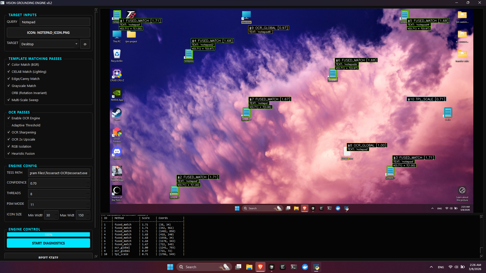

# Vision‑Based Desktop Automation — Notepad Workflow

> Technical overview of a desktop automation system that locates the Notepad icon using computer vision or a vision-language model (VLM), launches the application, and programmatically saves fetched content.

---

## Authorship & Tooling Note

I implemented the automation architecture, grounding pipelines, FSM orchestration, and robustness features. The included PySide6 diagnostic GUIs were implemented from the specifications and workflows I designed; an AI assistant generated the GUI code and I validated and debugged it.

These GUIs are development utilities for visualization and tuning and are not required to run the core automation workflow.

---

## Core Solution Overview

The primary objective is to reliably locate and interact with a desktop icon (Notepad) using vision-based methods (OpenCV and a vision-language model), even when the icon position changes.

The core workflow is as follows:

1. **Fetch the first 10 posts from the JSONPlaceholder API** before launching Notepad to separate network I/O from UI automation and improve efficiency.
2. Capture a screenshot of the desktop.
3. Detect the Notepad icon using computer vision grounding.
4. Return the center coordinates of the detected icon.
5. Double-click the icon to launch Notepad.
6. Verify that Notepad successfully opened.
7. Insert each post into Notepad and save it as `post_{id}.txt` in `Desktop/tjm-project`.

To increase reliability, the system includes retry logic, window verification, and candidate ranking to handle detection failures or false positives.

Additional tooling (diagnostic GUIs, hybrid grounding strategies, monitoring) was implemented to assist development and experimentation but is not required for the core automation workflow

---

## Project Goals

This project was designed to explore three main ideas:

- **Robust visual grounding** for desktop automation
- **Reliability mechanisms** such as retries, verification loops, and candidate ranking
- **Flexible perception strategies** combining traditional computer vision techniques and vision-language models (VLMs)

While the example task targets Notepad, the design focuses on building grounding techniques that can generalize to other desktop UI automation tasks.

---

## Prerequisites

This project is designed for **Windows 10/11**. The environment is fully managed via a bootstrap script, meaning **you do not need to have Python pre-installed.**

- **Internet Connection:** Required for the initial setup to fetch the isolated Python toolchain and project dependencies.
- **Tesseract OCR:** Required for the Computer Vision grounding engine.
  - [Download Tesseract](https://github.com/UB-Mannheim/tesseract/wiki) and ensure the installation path matches `TESSERACT_PATH` in your `.env`.
- **Gemini API Key:** Required for VLM-based grounding modes (Gemini 2.0).

---

## Quick Run & Bootstrapping

To ensure a consistent, zero-footprint execution environment, the project uses an automated bootstrap process to eliminate manual environment configuration.

1. **One-Click Provisioning:** Run **`setup.bat`**.
   - The script detects if the `uv` package manager is present.
   - If missing, it **auto-installs `uv`** and updates the session path.
   - It then **automatically downloads the required Python 3.14 toolchain** and synchronizes all dependencies into a locked virtual environment.
2. **Launch:** Execute the batch file corresponding to your desired mode (see the table below).
3. **Permissions:** Click **Yes** if the Windows UAC prompt appears. This is required for the `BlockInput` safety feature and high-precision hardware-level mouse control.

### Entry Point Reference

| Batch File                      | Engine Mode       | Primary Use Case                                                     |
|---------------------------------|-------------------|----------------------------------------------------------------------|
| **`setup.bat`**                 | **Bootstrap**     | **Run first.** Provisions Python, `uv`, and all locked dependencies. |
| **`run_notepad_vlm.bat`**       | AI (VLM)          | Advanced visual reasoning to locate icons via Gemini.                |
| **`run_notepad_cv_first.bat`**  | Hybrid            | Standard mode: CV primary with VLM fallback.                         |
| **`run_notepad_vlm_first.bat`** | Hybrid            | Testing mode: VLM primary with CV fallback.                          |
| **`run_cv_lab.bat`**            | Diagnostic GUI    | Tuning OpenCV thresholds and multiscale factors.                     |
| **`run_vlm_lab.bat`**           | Diagnostic GUI    | Validating AI grounding coordinates and prompts.                     |
| **`run_fsm_telemetry.bat`**     | FSM Viewer        | Visualizes execution timelines, screenshots, and FSM states.         |

> **Note on Permissions:** All execution scripts automatically request Administrative privileges. This is required for the `BlockInput` safety feature and hardware-level mouse control.

### Execution Commands

| Command                    | Action                                                   |
|----------------------------|----------------------------------------------------------|
| `uv sync`                  | Sync project dependencies and environment                |
| `uv run start-vlm`         | Launch the Vision-Language Model Diagnostic Lab          |
| `uv run start-cv`          | Launch the OpenCV/OCR Grounding Diagnostic Lab           |
| `uv run fsm-telemetry`     | Launch the FSM Telemetry Manifest Viewer                 |
| `uv run notepad-cv`        | Run the standard Notepad automation using the CV engine  |
| `uv run notepad-vlm`       | Run the standard Notepad automation using the VLM engine |
| `uv run notepad-cv-first`  | Attempt CV detection first, fall back to VLM if it fails |
| `uv run notepad-vlm-first` | Attempt VLM detection first, fall back to CV if it fails |

---

### Environment Setup

- **Desktop Shortcut:** Place a shortcut to **Notepad** on your primary desktop.
- **Tesseract OCR:** Install [Tesseract](https://github.com/UB-Mannheim/tesseract/wiki) and note the installation path.
- **Environment Variables:** Create a `.env` file in the root directory (use `example.env` as a template):

  ```bash
  GEMINI_API_KEY=your_google_api_key_here
  API_URL=https://jsonplaceholder.typicode.com/posts
  ```

---

## Architecture & Repository Structure

The project is organized around two complementary grounding engines — an OpenCV-based perception pipeline and a vision-language model (VLM) — and a shared core for automation, screenshot management, and state orchestration.

1. **ScreenshotService** [(`src/screenshot_service.py`)](src/screenshot_service.py) — Manage workspace state (minimize/restore) and capture high-DPI desktop/app states.
2. **Grounding Engines** ([`src/vlm_strategy/engine.py`](src/vlm_strategy/engine.py), [`src/cv_strategy/engine.py`](src/cv_strategy/engine.py)) — Translate high-level intent into screen coordinates using either AI reasoning or traditional CV+OCR fusion.
3. **Automation Orchestration** ([`src/notepad_task.py`](src/notepad_task.py), [`src/strategies.py`](src/strategies.py)) — Drive the finite state machine for launching, typing, saving, and switching perception strategies.
4. **Diagnostic Tooling** ([`src/vlm_strategy/gui.py`](src/vlm_strategy/gui.py), [`src/cv_strategy/gui.py`](src/cv_strategy/gui.py)) — Provide PySide-based interfaces for real-time detection debugging and coordinate verification.

---

## Architecture Summary

The system is organized into three main components:

### 1. Screenshot & Environment Handling

- Captures desktop screenshots
- Handles DPI awareness and coordinate normalization
- Manages workspace state (minimize / restore windows)

### 2. Grounding Engines

Two independent detection strategies are implemented:

- **OpenCV Grounding Engine** – template matching, feature detection, and OCR fusion
- **VLM Grounding Engine** – semantic icon detection using a vision-language model

The engines return ranked candidate coordinates representing potential UI elements.

### 3. Automation Orchestration & UI Drivers

A strict Finite State Machine (FSM) controller coordinates the automation workflow, delegating low-level OS interactions to dedicated UI drivers:

- **FSM Orchestrator:** Manages the high-level lifecycle (launching, fetching, saving, retry logic) through explicit, tracked states (e.g., `INIT`, `LAUNCH`, `WRITE`, `SAVE`).
- **Page Object Model (POM):** Low-level UI interactions are abstracted into a `NotepadDriver`. This isolates window focus, clipboard pasting, and OS-specific dialog navigation (like Windows 11 tab handling) away from the core business logic.

---

### Repository Tree

```text
.
├── src/
|   ├── assets
|   |   └── notepad_icon.png     # Reference template for OpenCV multiscale grounding
│   │
│   ├── cv_strategy/             # Traditional Computer Vision Grounding
│   │   ├── processors/          # Specialized detection modules
│   │   │   ├── visual.py        # Execute template matching & feature detection
│   │   │   ├── ocr.py           # Integrate Tesseract OCR engine
│   │   │   └── fusion.py        # Combine CV and OCR results
│   │   ├── __init__.py          # Initialize package
│   │   ├── engine.py            # Coordinate the CV processing pipeline
│   │   ├── constants.py         # Centralize detection thresholds and config
│   │   ├── models.py            # Define data structures for CV hits
│   │   ├── utils.py             # Provide image processing helper functions
│   │   └── gui.py               # PySide6 diagnostic interface for CV debugging
|   |
│   ├── vlm_strategy/            # AI-Driven Grounding (VLM)
│   │   ├── __init__.py          # Expose public API (Engine and Client)
│   │   ├── client.py            # Communicate with Google GenAI API & parse JSON
│   │   ├── engine.py            # Orchestrate AI detection, retries, and verification
│   │   ├── models.py            # Define data contracts (AIDetection, UIElementNode)
│   │   ├── prompts.py           # Store system instructions and VLM templates
│   │   ├── utils.py             # Calculate DPI awareness and coordinate scaling
│   │   └── gui.py               # PySide6 diagnostic interface for visualizing detections
│   │
│   ├── screenshot_service.py    # Manage High-DPI screen captures and windows
│   ├── core.py                  # Provide foundational primitives and logging
│   ├── main.py                  # Provide entry points for the automation pipeline
│   ├── monitoring.py            # Track performance and log visual artifacts
│   ├── notepad_task.py          # Orchestrate FSM logic for the Notepad workflow
│   └── strategies.py            # Define logic for switching VLM/CV modes
│
├── setup.bat                    # Bootstrap: Auto-installs uv, provisions Python 3.14, and syncs env
├── run_fsm_telemetry.bat        # Launch FSM Telemetry Viewer (Timeline, Screenshots, Context)
├── run_cv_lab.bat               # Launch CV engine GUI for anchor testing and grounding
├── run_vlm_lab.bat              # Launch VLM engine GUI for prompt engineering and vision testing
├── run_notepad_cv.bat           # Run automation using Computer Vision (OpenCV/Template) strategy
├── run_notepad_vlm.bat          # Run automation using Vision Language Model (AI) strategy
├── run_notepad_cv_first.bat     # Run hybrid automation: CV primary with VLM fallback
├── run_notepad_vlm_first.bat    # Run hybrid automation: VLM primary with CV fallback
│
├── pyproject.toml               # Configure build system and dependencies (uv)
├── example.env                  # Provide template for environment variables
└── .env                         # Store local secrets (API Keys)
```

---

## Libraries Used

| Library                 | Purpose                                                                    |
| ----------------------- | -------------------------------------------------------------------------- |
| `pyautogui`             | Screenshot and input automation                                            |
| `pygetwindow`           | Enumerate/manage OS windows                                                |
| `pyperclip`             | Clipboard interaction for paste reliability                                |
| `requests`              | Fetch posts data                                                           |
| `python-dotenv`         | Load `.env` variables                                                      |
| `Pillow`                | Image manipulation (ScreenshotService)                                     |
| `google.genai`          | Gemini Vision VLM API for semantic UI grounding                            |
| `opencv-python`         | Template matching and image processing                                     |
| `numpy`                 | Array math and geometry utilities                                          |
| `pytesseract`           | OCR engine for textual passes                                              |
| `psutil`                | Safe termination of bot-owned orphan processes without affecting user apps |

---

## Grounding Engine Internal Logic

The system utilizes two distinct strategies to translate high-level intent into screen coordinates. This dual-engine approach ensures robustness across different UI styles and resolutions.

### 1. CV Grounding Engine (CV + OCR)

This engine uses a "fused" approach, running visual template matching and Tesseract OCR in parallel to find both the icon and the text label.


```mermaid
flowchart TD
    Start([match_ui_elements]) --> Load[Load PIL Screenshot]
    Load --> Conv[Convert PIL to BGR / NumPy]
    Conv --> Abort1{Abort Requested}
    Abort1 -->|Yes| EndEmpty[Return Empty]
    Abort1 -->|No| Detect[Detect Window Size]

    Detect --> IconCheck{Icon Provided}

    %% TEMPLATE PIPELINE
    IconCheck -->|Yes| TemplateFlags{Template Pass Enabled}
    IconCheck -->|No| SkipTemplates[Skip Template Passes]

    TemplateFlags -->|Yes| Gray[Gray Template Pass]
    TemplateFlags -->|Yes| Color[Color Template Pass]
    TemplateFlags -->|Yes| LAB[LAB Template Pass]
    TemplateFlags -->|Yes| Edge[Edge Template Pass]
    TemplateFlags -->|Yes| Multi[Multi Scale Template Pass]
    TemplateFlags -->|Yes| ORB[ORB Feature Pass]

    Gray --> CollectHits
    Color --> CollectHits
    LAB --> CollectHits
    Edge --> CollectHits
    Multi --> CollectHits
    ORB --> CollectHits

    CollectHits[Collect All Template Hits] --> NMS1[Initial Template NMS]
    NMS1 --> Validate{Icon And Hits Present}

    Validate -->|Yes| Spatial[Aspect Ratio Geometric Validation]
    Validate -->|No| TemplatesReady

    Spatial --> TemplatesReady
    SkipTemplates --> TemplatesReady

    %% OCR PIPELINE (Global first)
    TemplatesReady --> OCRCheck{OCR Enabled & Text Query Present}
    OCRCheck -->|No| OCRDone
    OCRCheck -->|Yes| GlobalOCR[Global OCR Search Sweep]

    GlobalOCR --> OCRPrep[OCR Preprocessing Variants]
    OCRPrep --> CLAHE[CLAHE Contrast Enhancement]
    OCRPrep --> Binary[Adaptive Thresholding]
    OCRPrep --> Upscale[Resolution Upscaling]
    OCRPrep --> TopHat[Top-hat Morphological Filter]

    CLAHE --> OCRRun
    Binary --> OCRRun
    Upscale --> OCRRun
    TopHat --> OCRRun

    OCRRun[Run Tesseract - Multiple PSM Modes] --> ConfidenceGate{OCR Confidence Above Threshold}

    ConfidenceGate -->|Yes| TextMatch[Semantic Text Similarity Matching]
    ConfidenceGate -->|No| RejectOCR[Discard Low Confidence Noise]

    TextMatch --> OCRAggregation[OCR Result Aggregation + Deduplication]
    RejectOCR --> OCRAggregation

    %% TARGETED RECOVERY (Triggered by Visual Anchors)
    OCRAggregation --> RecoveryCheck{Templates & Text Query Present}
    RecoveryCheck -->|Yes| TargetedRecovery[Targeted ROI OCR Around Visual Hits]
    RecoveryCheck -->|No| OCRDone

    TargetedRecovery --> OCRDone

    %% FUSION
    OCRDone --> FusionStart[Fusion & Reconciliation Stage]
    FusionStart --> PairMatch{Spatial Proximity Match?}

    PairMatch -->|Match| CreateFused[Create Fused Candidate + Score Bonus]
    PairMatch -->|No Match| KeepUnmatched[Keep Unmatched Candidates]

    CreateFused --> CollectAll
    KeepUnmatched --> CollectAll

    CollectAll[All Candidates] --> Sort[Sort by Score: Fused > Single-Source]
    Sort --> Proximity[Final Spatial Deduplication]

    %% FINAL FILTER
    Proximity --> Threshold{Score >= Threshold}
    Threshold -->|Yes| Keep
    Threshold -->|No| Discard

    Keep --> EndReturn[Ranked Candidate List]
    Discard --> EndReturn

    %% ---------- STYLING ----------
    classDef entry fill:#1b5e20,stroke:#66bb6a,color:#ffffff
    classDef decision fill:#4a148c,stroke:#ba68c8,color:#ffffff
    classDef template fill:#0d47a1,stroke:#64b5f6,color:#ffffff
    classDef ocr fill:#bf360c,stroke:#ff8a65,color:#ffffff
    classDef fusion fill:#263238,stroke:#90a4ae,color:#ffffff
    classDef terminal fill:#b71c1c,stroke:#ef9a9a,color:#ffffff
    classDef preprocessing fill:#5d4037,stroke:#d7ccc8,color:#ffffff

    class Start,Load,Conv,Detect entry
    class Abort1,IconCheck,TemplateFlags,Validate,OCRCheck,RecoveryCheck,PairMatch,Threshold decision
    class Gray,Color,LAB,Edge,Multi,ORB,CollectHits,NMS1,Spatial,SkipTemplates template
    class GlobalOCR,OCRRun,TargetedRecovery,OCRAggregation ocr
    class FusionStart,CreateFused,KeepUnmatched,CollectAll,Sort,Proximity fusion
    class EndEmpty,EndReturn,Discard terminal
    class OCRPrep,CLAHE,Binary,Upscale,TopHat preprocessing

```

### 2. VLM Grounding Engine (AI Vision)

The AI engine interprets the screen as a coordinate grid, utilizing "Position Inference" to map semantic instructions (e.g., "Find the Notepad icon") to precise bounding boxes.


```mermaid
flowchart TD
    Start([resolve_coordinates]) --> DPI[Setup DPI Awareness]
    DPI --> Scope{Target Window?}

    Scope -->|Desktop| Full[Capture Desktop PIL Image]
    Scope -->|Specific App| FindWin[Locate Target Window Coords]

    FindWin --> Iso[In-Memory Canvas: Draw Red Anchor]
    Full --> Prep
    Iso --> Prep

    Prep[In-Memory PIL Object] --> Context[Build Prompt with Ref & Exclusion Context]
    Context --> RetryLoop{Retry Attempts Remaining}

    %% API Interaction
    RetryLoop --> Call[Call Gemini Vision API]
    Call --> APIError{API Exception?}
    APIError -->|Yes| RetryDecision
    APIError -->|No| Extract[Regex Extract JSON Array]

    Extract --> ValidJSON{Valid JSON?}
    ValidJSON -->|No| RetryDecision
    ValidJSON -->|Yes| EmptyCheck{Results Empty?}

    EmptyCheck -->|Yes| RetryDecision
    EmptyCheck -->|No| ProcessLoop

    RetryDecision{More Attempts?}
    RetryDecision -->|Yes| Call
    RetryDecision -->|No| FailReturn[Return Empty List]

    %% Coordinate Transformation Pipeline
    ProcessLoop{For Each Raw Detection}
    ProcessLoop --> Scaling[Scale 0-1000 to Absolute Pixels]
    Scaling --> Size[Extract W/H Size]
    Size --> Center[Compute Center Coords]

    %% Optional Verification Step
    Center --> VerifyFlag{Verify Enabled?}
    VerifyFlag -->|No| Debug
    VerifyFlag -->|Yes| Crop[Fresh Desktop Capture & Crop]
    Crop --> VerifyPrompt[Build Verification Prompt]
    VerifyPrompt --> VerifyCall[Vision API: Secondary 'Eyes-on' Check]
    VerifyCall --> VerifyResult{AI Confirms Target?}
    VerifyResult -->|No| Discard[Discard Candidate]
    VerifyResult -->|Yes| Debug

    %% Finalize
    Discard --> LoopCheck
    Debug[Save Visual Debug Frame if Enabled] --> LoopCheck
    LoopCheck{More Detections?}
    LoopCheck -->|Yes| ProcessLoop
    LoopCheck -->|No| SuccessReturn[Return Ranked UIElementNodes]

    %% ---------- STYLING ----------
    classDef entry fill:#1b5e20,stroke:#66bb6a,color:#ffffff
    classDef decision fill:#4a148c,stroke:#ba68c8,color:#ffffff
    classDef ai fill:#0d47a1,stroke:#64b5f6,color:#ffffff
    classDef transform fill:#5d4037,stroke:#d7ccc8,color:#ffffff
    classDef success fill:#2e7d32,stroke:#a5d6a7,color:#ffffff
    classDef failure fill:#b71c1c,stroke:#ef9a9a,color:#ffffff

    class Start,DPI,Full,FindWin,Iso entry
    class Scope,RetryLoop,APIError,ValidJSON,EmptyCheck,RetryDecision,VerifyFlag,VerifyResult decision
    class Call,Extract,VerifyCall,VerifyPrompt ai
    class Scaling,Size,Center,Crop transform
    class SuccessReturn success
    class FailReturn failure
```

---

## Notepad Automation Workflow (Step-by-Step)

### 1. Workspace Preservation & Dynamic Safety

- **Archive Old Posts:** Before starting, the system moves any existing `.txt` results from the project directory to an `/archive` folder.
- **Window Snapshot:** The automation captures the current state of visible windows to restore your workspace after execution.
- **Hardware Lock:** Hardware input (mouse and keyboard) is programmatically blocked via `BlockInput` during the **Launch Sequence** to prevent accidental clicks.
- **Dynamic Interference Watchdog:** During non-locked phases, a background watchdog tracks mouse pixel drift. If user interference is detected, the system takes a mid-run snapshot of the workspace, pauses execution until the mouse is stable for a set duration, restores the workspace, and seamlessly resumes the FSM.

---

### 2. For Each of the First 10 Posts

#### A — Prepare Desktop State

- **Minimize All:** Windows are minimized (`Win + M`) to provide a clean desktop "canvas" for the vision engines.
- **In-Memory Capture:** The system takes a high-resolution screenshot processed in RAM.

#### B — Perception & Launch Sequence

- **Hybrid Strategy:** The system uses a multi-layered approach to find the Notepad shortcut:
  - **Primary Engine:** Attempts detection (e.g., OpenCV template matching/OCR).
  - **Fallback Engine:** If the primary engine fails, the secondary engine (Gemini Vision VLM) is automatically triggered.
- **Launch Retry Loop:** Iterates through candidates sorted by confidence score. It performs a double-click and polls for the target window handle 6 times. If it fails, it moves to the next candidate.

#### C — Content Injection

1. **Fresh Document:** `Ctrl + N` is sent to ensure the editor is ready.
2. **Fast Paste:** Content is moved to the clipboard and injected via `Ctrl + V`. This bypasses slow character-by-character typing and prevents encoding errors.

#### D — Save File

1. **Trigger:** `Ctrl + S` opens the "Save As" dialog.
2. **Pathing:** The system waits for the dialog handle, focuses the filename field (`Alt + N`), and pastes the absolute path: `Desktop/tjm-project/post_{id}.txt`.
3. **Overwrite Handling:** If a "Confirm Save As" prompt appears, the system automatically sends `Alt + Y` to overwrite the existing file.
4. **Retry Resiliency:** Because UI dialogs can occasionally flicker or fail to register keystrokes, the entire file-save interaction is wrapped in a retry loop with exponential backoff.
5. **Close:** Closes the editor via `Ctrl + W` with a fallback safety close.

#### E — Teardown & Observability

- **Surgical Cleanup:** Unconditionally terminates the specific Notepad process initiated by the FSM (via tracked PID), leaving the user's pre-existing Notepad windows completely untouched.
- **Restore:** Re-opens the windows captured in the initial snapshot.
- **Telemetry & Replay:** Finalizes the `metadata.json` run manifest and compiles a comprehensive `.mp4` video replay of all captured screenshots and errors for post-run auditing.

---

## Error Handling, Observability & Robustness

- **Strict FSM Orchestration:** The core workflow is governed by a strict Finite State Machine. Every transition (e.g., `LAUNCH` to `WRITE`) resets background watchdog timers and emits structured telemetry, preventing the system from desyncing from the UI state.
- **Granular Run Metrics & Structured JSON Logging:** Execution telemetry is managed by a `StructuredLogger` that outputs standard JSON. At the end of a run, a `RunMetrics` schema is finalized into a `metadata.json` manifest, capturing total processed counts, specific failure categories (launch vs. save failures), success rates, and exact execution timings in seconds for every FSM state.
- **Dynamic User Interference Watchdog:** A background poller tracks user mouse drift. If the user moves the mouse to take control, the automation automatically pauses, waits for stability, and gracefully resumes without failing the run.
- **Centralized Exponential Retry Strategy:** A higher-order `retry` function manages transient failures with exponential backoff and jitter. This is applied to network I/O, brittle UI dialogs, and the initial application launch sequence.
- **Page Object Model (POM) Isolation:** Low-level keystrokes are abstracted away from the FSM into a `NotepadDriver`. This prevents rogue keystrokes from leaking into the OS if the target window loses focus.
- **Surgical Process Cleanup:** Instead of blindly killing all Notepad instances, the FSM tracks the specific `bot_pid` initiated by the automation and gracefully terminates only the bot-owned process via `psutil`.

---

## Screenshots & GUIs

### VLM Grounding GUI

Example of detected VLM coords:


### Vision Grounding GUI

Example of detected OpenCV + OCR coords:


### Diagnostic GUIs & Telemetry Viewer

The project includes PySide6-based diagnostic interfaces used to visualize grounding results, tune detection parameters, and audit historical runs. These tools are **development utilities** and are not required to run the headless automation workflow.

#### 1. Vision Laboratories (CV & VLM)

- **Live Inspection:** Toggle detection passes (LAB, Edge, etc.) and visualize bounding boxes in real-time to see what the perception engines are seeing.
- **Threshold Hot-Swapping:** Adjust engine constants via GUI sliders to find the optimal detection thresholds for your specific wallpaper and DPI scaling.

#### 2. FSM Telemetry Dashboard (`run_fsm_telemetry.bat`)

Because the automation generates structured JSON manifests and step-by-step screenshots, a dedicated Telemetry Viewer allows for post-run auditing:

- **Execution Timeline Scrubbing:** Navigate through the exact sequence of FSM states (`INIT` -> `LAUNCH` -> `WRITE`, etc.) to see exactly where a failure occurred.
- **Rich Visualizations:** Features asynchronous background loading for step thumbnails, run-level metric summaries, and a zoomable image canvas with a magnifier tool to inspect visual artifacts and surgical masks.
- **Video Replay Integration:** Directly launch the `.mp4` execution replay compiled by OpenCV from within the dashboard.

---

## Workflow Diagram


```mermaid
flowchart TD
    Start(["Start"]) --> Init["Initialize Environment"]
    Init --> Prep["Archive Outputs + Snapshot User Windows"]
    Prep --> Fetch["Fetch Posts (Retry + Backoff)"]

    Fetch --> FetchOK{"Fetch Successful?"}
    FetchOK -->|No| Cleanup
    FetchOK -->|Yes| Loop["Iterate Posts (Max 10)"]

    %% LAUNCH PHASE
    Loop --> DesktopPrep["Prepare Desktop (ScreenshotService)"]

    subgraph Perception ["Perception (Strategy-Based Grounding)"]
        direction TB
        Attempt1["Primary Strategy (CV or VLM)"] --> Found{"Candidates Found?"}
        Found -->|No| Hybrid{"Fallback Strategy Available?"}
        Hybrid -->|Yes| Attempt2["Fallback Strategy"]
        Hybrid -->|No| PerceptionFail["Perception Failed"]
        Found -->|Yes| Rank["Rank Candidates (Score + Heuristics)"]
        Attempt2 --> Rank
    end

    DesktopPrep --> Attempt1

    %% INTERACTION PHASE
    subgraph Interaction ["Interaction (Candidate Execution Loop)"]
        direction TB
        Pick["Select Next Candidate"] --> Lock["Acquire Input Lock (OS-level)"]
        Lock --> Click["Double-click Target Coordinates"]
        Click --> Unlock["Release Input Lock (finally)"]
        Unlock --> Verify{"Window Detected? (Polling)"}
        Verify -->|No| More{"More Candidates?"}
        More -->|Yes| Pick
        More -->|No| InteractionFail["Launch Failed"]
    end

    Rank --> Pick

    Verify -->|Yes| DriverInit["Initialize Notepad Driver"]

    %% WRITE + SAVE PHASE
    DriverInit --> Write["Write Post Content"]
    Write --> Save["Save File (Retry Wrapped)"]

    Save --> SaveOK{"Save Successful?"}
    SaveOK -->|No| SaveFail["Save Failed"]
    SaveOK -->|Yes| Close["Close Notepad"]

    Close --> Metrics["Update Metrics + Artifacts"]

    %% LOOP CONTROL
    Metrics --> Next["Increment Post Index"]
    SaveFail --> Next
    InteractionFail --> Next
    PerceptionFail --> Next

    Next -->|More Posts| Loop
    Next -->|Done| Cleanup["Cleanup Bot Windows + Processes"]

    %% FINALIZATION
    Cleanup --> Restore["Restore User Workspace"]
    Restore --> Video["Compile Run Video"]
    Video --> Finalize["Persist Metrics + Telemetry"]
    Finalize --> End(["End"])

    %% STYLING
    classDef entry fill:#1b5e20,stroke:#66bb6a,color:#ffffff
    classDef action fill:#0d47a1,stroke:#64b5f6,color:#ffffff
    classDef decision fill:#4a148c,stroke:#ba68c8,color:#ffffff
    classDef safety fill:#f57f17,stroke:#fbc02d,color:#ffffff
    classDef terminal fill:#b71c1c,stroke:#ef9a9a,color:#ffffff

    class Start,End,Finalize entry
    class Init,Prep,Fetch,DesktopPrep,Attempt1,Attempt2,Rank,Pick,Click,Write,Save,Close,Metrics,Next,Cleanup,Restore,Video action
    class FetchOK,Found,Hybrid,Verify,More,SaveOK decision
    class Lock,Unlock safety
    class PerceptionFail,InteractionFail,SaveFail terminal

    style Perception fill:#263238,stroke:#00e5ff,stroke-width:2px,color:#fff
    style Interaction fill:#263238,stroke:#00e5ff,stroke-width:2px,color:#fff
```

---

## Scaling to Arbitrary Tasks

Although this project targets the Notepad desktop shortcut, the architecture was designed to explore how the same grounding techniques could generalize to other desktop automation tasks.

### 1. Strategy-Based Orchestration

The system utilizes a **Strategy Pattern** (see `strategies.py`). By swapping the `LaunchStrategy`, you can change the entire perception logic without touching the FSM.

- **Configurable Targets:** Target any app (e.g., "Slack", "VS Code", "Terminal") by simply updating `VLM_INSTRUCTION`, `OPENCV_TEXT_QUERY`, and `ICON_PATH`.
- **Plug-and-Play Engines:** The `NotepadTask` accepts any implementation of `LaunchStrategy`, allowing for future integration of specialized models (e.g., YOLO or Detectron2) with zero refactoring of the core business logic.

### 2. Resolution & DPI Independence

The `ScreenshotService` and grounding engines ensure cross-hardware compatibility through two mechanisms:

- **Hardware Awareness:** The system calls `SetProcessDpiAwarenessContext` to ensure Windows reports physical pixel grids rather than logical scaled coordinates.
- **Coordinate Normalization:** The vision engines operate on a 0-1000 normalized scale. The transformation to screen space is calculated as:
  $$Pixel_{coords} = \frac{Normalized_{coords}}{1000} \cdot Resolution_{max}$$
  This allows identical logic to function perfectly on 1080p, 1440p, or 4K monitors.

### 3. Precision Grounding & Isolation

- **Attention Masking:** For targeting elements within specific windows, the engine can draw a 10px red boundary to isolate the ROI (Region of Interest). This "Isolation Mode" significantly reduces AI hallucinations by forcing the vision model to ignore background noise.
- **Hybrid Resiliency:** You can chain engines (e.g., `HybridCVFirstStrategy`) so that if a lightweight CV check fails, a heavy-duty VLM check automatically takes over.

### 4. Semantic Flexibility

Unlike rigid "pixel-hunting" bots, the VLM engine understands **intent**. It can find an icon based on visual descriptions (e.g., *"the blue icon with a white 'W'"*) rather than exact filename matches, making it robust against OS theme changes, custom icon packs, or localized system languages

---

## Design Decisions

The following sections explain the reasoning behind the grounding strategies and robustness mechanisms used in this project. The goal was to build a detection system that remains reliable even when desktop conditions change (icon position, background noise, DPI scaling, or partial occlusion).

### Perception Strategy: Hybrid Grounding

The system employs a **dual-engine approach** to solve the "Grounding Problem" in desktop automation:

- **VLM Grounding (Semantic):** Uses a Gemini Vision-Language Model for high-level semantic reasoning. It excels at "fuzzy" matches where icons might be slightly different or moved.
- **OpenCV Grounding (Heuristic):** Provides low-latency, pixel-level precision for exact matches.
- **The "Why":** This hybrid approach balances cost and speed. The system attempts a lightweight local CV check first and only escalates to a cloud-based VLM if the local heuristic fails to achieve a high confidence score.

### Performance & Optimization

- **Parallel Detection Passes:** To minimize UI latency, the OpenCV engine executes multiple detection passes (Color, Grayscale, Edge-map, and LAB) in parallel using a `ThreadPoolExecutor` with up to 8 concurrent workers.
- **In-Memory Processing:** To maximize speed and privacy, all screenshots and intermediate visual crops are handled as in-memory buffers (PIL/MatLike). No temporary files are written to the disk during the detection phase.

### Robustness & Scaling Logic

- **Transparent Template Matching:** The engine utilizes 4-channel (BGRA) templates. By extracting the alpha channel as a **mask**, the matching algorithm ignores the desktop wallpaper or "busy" background noise, focusing strictly on the icon's unique geometry.
- **Geometry Validation:** To filter out false positives (like text blocks or taskbar elements), matches are ranked by a **Geometric Aspect Ratio Score**:
    $$\text{Score}_{geom} = \frac{\min(R_{target}, R_{hit})}{\max(R_{target}, R_{hit})}$$
- **Resolution Independence:** The system utilizes a normalized coordinate system (0–1000). Physical click coordinates are calculated dynamically based on the active monitor resolution:
    $$Pixel_{coords} = \frac{Normalized_{coords}}{1000} \cdot Resolution_{max}$$
- **Multi-Scale Robustness:** The engine automatically generates a pyramid of icon scales. This ensures the bot works regardless of whether the user has Windows icons set to "Small," "Medium," or "Large."

### Safety & Resiliency

- **Windows Input Blocking:** During critical double-click sequences, the system invokes `BlockInput(True)` via `user32.dll`. This prevents the user's physical mouse movements from knocking the bot off-target.
- **Confirmation Loops:** The FSM doesn't just "click and pray." It performs post-action verification by monitoring window titles and handles, ensuring Notepad is actually active before attempting to paste content.

### Future Extensions

- **Local Vision Transformers:** Transitioning from Gemini VLM to local open-vocabulary vision models like **Grounding DINO** or **YOLO-World**. This would eliminate API costs and allow the system to run in completely "air-gapped" (offline) environments.
- **Contextual Self-Healing:** Implementing a "retry-with-variation" logic where the bot tries to right-click or use the Start Menu if the desktop shortcut is obscured by another window.

---

### Perception Engine Architecture

The "Brain" of this system is a multi-modal grounding engine that fuses visual heuristics with semantic text recognition.

### 1. Multi-Pass Detection Pipeline

The `CVGroundingEngine` executes a probabilistic detection pipeline across three distinct layers:

- **Global Visual Sweep:** 8-core parallel processing using a `ThreadPoolExecutor` to run Template Matching across Color (BGR), Perceptual (LAB), Grayscale, and Edge-map spaces simultaneously.
- **Global OCR Sweep:** A full-screen text search using Tesseract with multiple image-processing modes (OTSU, Inverted, and Top-hat filtering) and a **2.5x cubic upscale** to isolate labels from noisy backgrounds.
- **Targeted Recovery:** If an icon is found without a label, the engine generates a "Targeted ROI" sub-region (extending `1.6x` vertically) to force-search for text using fuzzy Levenshtein matching.

### 2. Spatial Fusion & Scoring

Final candidates are calculated by merging these layers. Every visual match is stress-tested against the expected aspect ratio of the icon using a **Geometric Validation** formula:
$$\text{Final Score} = \text{Match Score} \cdot (0.8 + (0.2 \cdot \text{Ratio Deviation}))$$

If a Visual hit and an OCR hit overlap within a specific radius, a `FUSION_SCORE_BONUS` (0.1) is applied, prioritizing candidates confirmed by both "sight" and "reading."

---

## Debugging & Engine Tuning

### 1. The Vision Laboratory (GUI)

The project includes a PySide6-based **Vision Lab** (`gui.py`) designed for real-time parameter tuning:

- **Live Inspection:** Toggle detection passes (LAB, Edge, etc.) to see which one is most effective for your current wallpaper.
- **Threshold Hot-Swapping:** Adjust `constants.py` values via the GUI sliders to find the "Sweet Spot" for your environment.
- **Coordinate Validation:** Click "Copy Best" to grab the physical pixel coordinates and verify alignment.

### 2. Tuning `constants.py`

All detection logic is governed by centralized constants. Use the table below to troubleshoot specific issues:

| Symptom              | Targeted Adjustment                                                                      |
|----------------------|------------------------------------------------------------------------------------------|
| **Missed Icons**     | Lower `TPL_COLOR_THRESHOLD`, `TPL_GRAY_THRESHOLD`, or expand `MULTISCALE_FACTORS`.       |
| **Duplicate Clicks** | Increase `NMS_RADIUS_FACTOR` or `FINAL_DEDUP_RADIUS_FACTOR`.                             |
| **Weak OCR Results** | Adjust `OCR_MIN_CONFIDENCE` or `OCR_RECOVERY_THRESHOLD`.                                 |
| **False Positives**  | Reduce `GEOM_RATIO_BONUS_WEIGHT` or increase relevant template thresholds.               |
| **Slow Detection**   | Reduce `MAX_TEMPLATE_HITS`, lower `RECOVERY_QUEUE_LIMIT`, or limit `MULTISCALE_FACTORS`. |

### 3. Visual Observability & Safety

- **Artifact Snapshots:** Upon a `FATAL` error, the `RunMonitor` saves a high-contrast debug image to `logs/run_id/errors/` with rendered bounding boxes and confidence scores.
- **Video Replays:** The system automatically stitches step-by-step screenshots into an `execution_replay.mp4` using OpenCV’s `VideoWriter`, allowing developers to watch the bot's decision-making process in real-time.
- **Telemetry:** Check `metadata.json` in the log folder for execution times, engine scores, and DPI awareness status.
- **Hardware Safety:** If the mouse is locked via `BlockInput`, the system automatically releases the lock upon task timeout or failure.

### 4. Hardware & DPI Checklist

If clicks land offset from the target:

1. **DPI Awareness:** Confirm the logs show `SetProcessDpiAwarenessContext` succeeded.
2. **Resolution Scale:** Ensure Windows "Display Settings" scale (e.g., 150%) is consistent. The engine handles scaling, but extreme settings may require larger icon templates.
